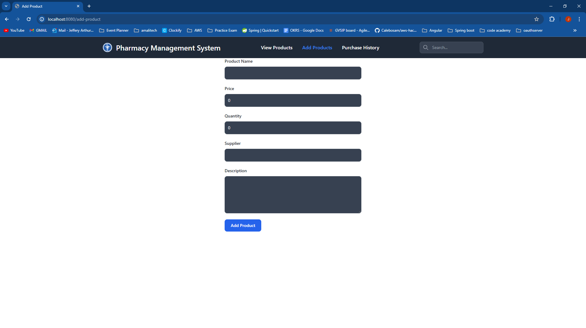
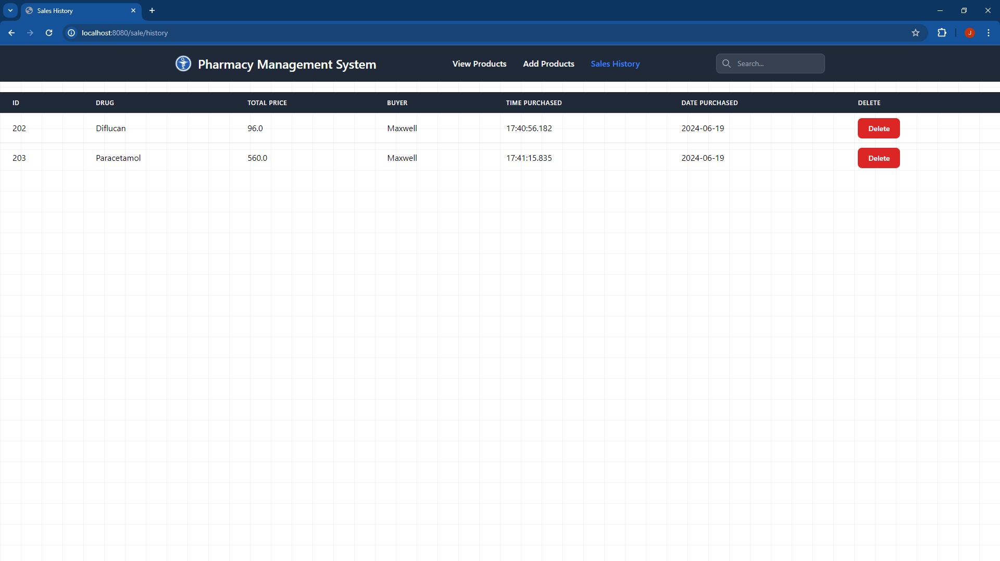
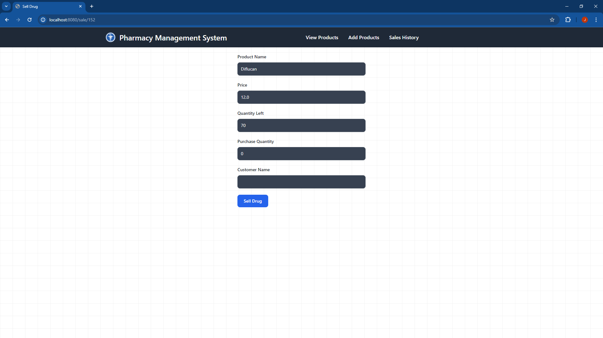
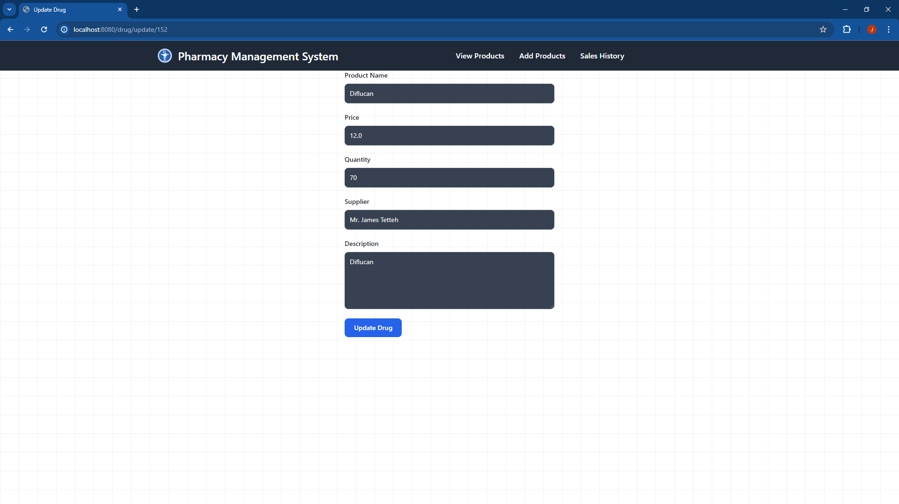
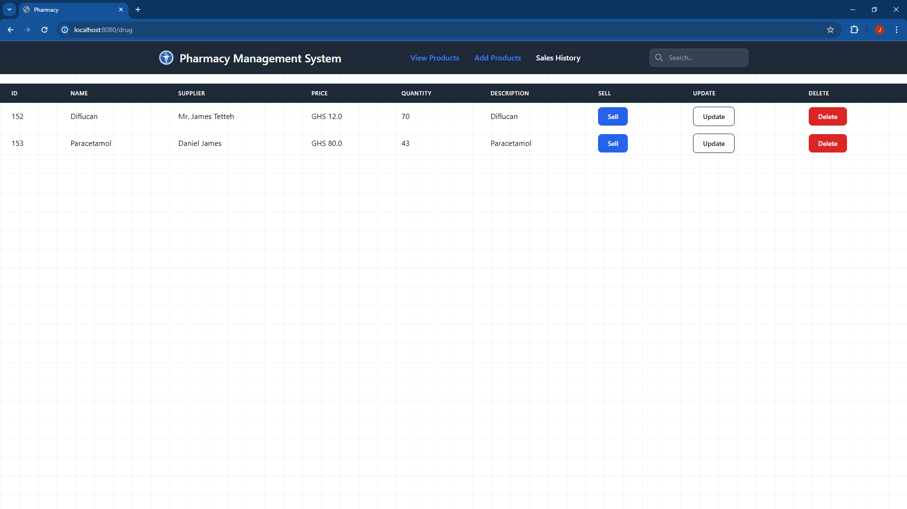

# PHARMACY MANAGEMENT SYSTEM

## DESCRIPTION
This project implements a Pharmacy Management System using Spring Boot and Thymeleaf.  
It allows pharmacists to manage drug inventory, track sales, view purchase history, and interact with suppliers and customers.  
The system leverages data structures and algorithms for efficient drug management and reporting.

## TASKS
- `Add Drugs`: Ability to add new drugs to the system.
- `Search for a Drug`: Search functionality to find drugs based on various parameters.
- `View All Drugs`: Display all drugs in the inventory along with their suppliers.
- `View Sale History`: Detailed purchase history for each drug, including timestamp, date, and buyer information.
- `Sell a Drug` : Sell a drug to a buyer.
- `Delete a Drug` : Delete a drug from the system.
- `Update a Drug` : Update a drug from the system.
- `Delete a Sale History` : Delete a sale history from the system.


## IMPLEMENTATION DETAILS
- `Backend`: Developed using Spring Boot, Java, and suitable data access technologies (JPA).
- `Frontend`: UI templates designed using Thymeleaf with HTML, CSS, and JavaScript as required.
- `Database`: PostgreSQL used for persistent data storage.

## INSTALLATION
- Clone the repository: 
```
git clone https://github.com/Kjeff24/Pharmacy-Management-System.git
```
- Open the project in your preferred IDE.
- Configure database settings in application.properties.
- Build and run the application

## PERFORMANCE OF THE ALGORITHMS
### Data Retrieval Operations
a. Finding a Drug (findById method)
- Operation: Retrieving an entity by its ID from the database.
- Complexity: `O(1)` on average.
- Justification: The findById() method is optimized to fetch entities directly using the primary key index. This results in constant-time complexity O(1), regardless of the total number of records in the database.

b. Finding All Drugs (findAll() method)
- Operation: Retrieving all drugs from the database.
- Complexity: `O(n)`, where n is the number of drugs in the database.
- Justification: The repository typically translates to a SQL query like SELECT * FROM drugs, which retrieves all records in linear time relative to the number of records.

c. Finding Drugs by Name (findAllByNameContainingIgnoreCase(String query) method)
- Operation: Searching for drugs by their name using a case-insensitive substring match.
- Complexity: Depends on the database indexing and query optimization, but generally `O(m)`, where m is the number of records matching the query criteria.
- Justification: The database query would involve searching through indexed columns efficiently, typically performing linear scans over the subset of matching records.

### Inserting and Updating Operations
a. Adding a Drug (save() method)
- Operation: Inserting a new drug into the database.
- Complexity: `O(1)` on average.
- Justification: JPA repositories use efficient persistence mechanisms provided by the underlying ORM (Object-Relational Mapping) framework, ensuring constant-time complexity for insert operations.

b. Updating a Drug (save() method with an existing entity)
- Operation: Updating an existing drug in the database.
- Complexity: `O(1)` on average.
- Justification: Similar to insertion, updating operations leverage efficient persistence strategies that avoid full-table scans, ensuring constant-time complexity.

### Deletion Operations
a. Deleting a Drug by ID (deleteById() method)
- Operation: Removing a drug from the database by its ID.
- Complexity: `O(1)` on average.
- Justification: Deletion operations are typically optimized for direct access and removal based on primary key constraints, ensuring constant-time complexity.






